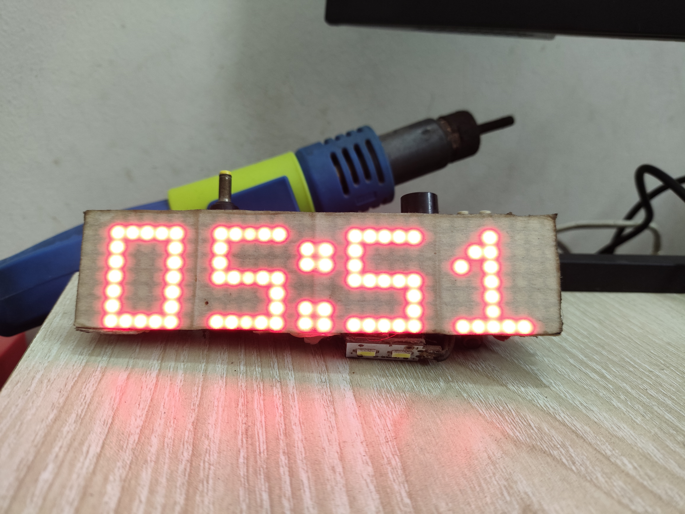
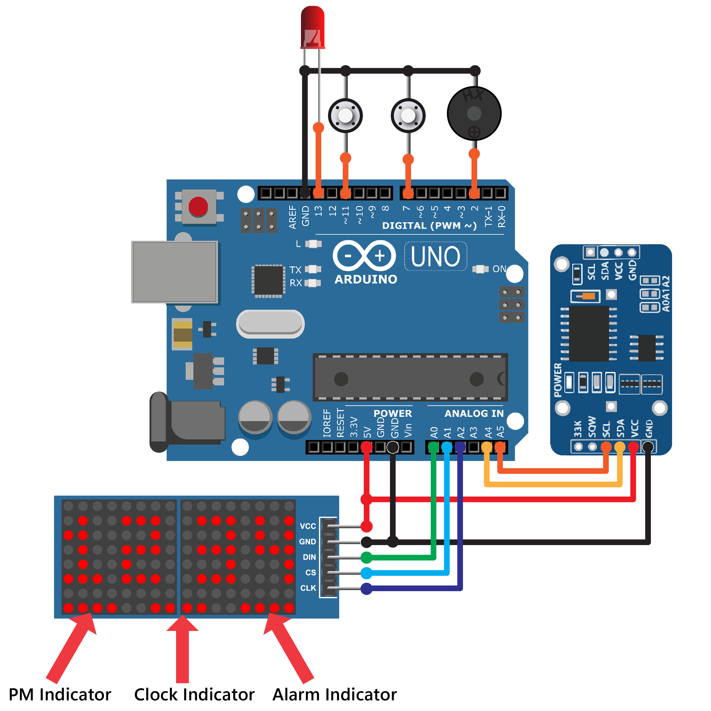

# Dot Matrix Alarm Clock with Spectrum Analyzer



A multifunctional Arduino-based digital alarm clock featuring:

* 🕒 Real-time clock display
* 🔔 Multiple alarm indicators
* 🎵 Sound-reactive spectrum analyzer
* 💡 LED matrix animations
* 🎛 Interactive menu system
* 🔊 Buzzer alarm notifications
* 🌡 Temperature & humidity monitoring
* ⚙ Servo-based alarm indicators

This project combines real-time clock functionality with visual sound effects and interactive controls using Arduino and LED matrix displays.

---

# 🧠 Project Overview

This system is designed as an advanced DIY digital clock featuring:

* Real-time clock tracking
* Multiple alarms
* Audio spectrum visualization
* LED matrix display system
* Interactive settings menu

The project uses:

* Arduino UNO
* DS3231 RTC Module
* MAX7219 LED Matrix
* Buzzer
* Servo Motors

making it both functional and visually engaging.

---

# ✨ Features

## 🕒 Real-Time Clock Display

Displays:

* Current time
* Seconds
* PM indicator
* Alarm indicators

using LED matrix displays.

---

## 🔔 Alarm System

Supports:

* Multiple alarms
* Alarm activation indicators
* Alarm countdown system
* Buzzer notifications

---

## 🎵 Spectrum Analyzer

Includes a sound-reactive LED spectrum analyzer for visual audio effects.

The matrix display reacts dynamically to sound signals and music input.

---

## ⚙ Servo-Based Indicators

Servo motors are used for:

* Physical alarm indication
* Mechanical visual feedback
* Interactive alarm movement effects

---

## 🎛 Interactive Menu System

Buttons allow:

* Time setting
* Alarm adjustment
* Menu navigation
* Sensor mode selection

---

# 🛠 Hardware Used

| Component          | Description             |
| ------------------ | ----------------------- |
| Arduino UNO        | Main controller         |
| MAX7219 LED Matrix | Dot matrix display      |
| DS3231 RTC Module  | Real-time clock         |
| Servo Motors       | Alarm indicators        |
| Buzzer             | Alarm sound             |
| Push Buttons       | User input              |
| LEDs               | Alarm status indicators |
| LiPo Battery       | Portable power          |
| DC-DC Converter    | Voltage regulation      |

---

# 💻 Software Structure

| File                                          | Description               |
| --------------------------------------------- | ------------------------- |
| `LED_Matrix_Clock_with_Spectrum_Analyzer.ino` | Main project file         |
| `clock_function.ino`                          | Clock management          |
| `alarm_function.ino`                          | Alarm logic               |
| `set_function.ino`                            | Time/alarm setting system |
| `menu(1).ino`                                 | Interactive menu          |
| `spectrum.ino`                                | Audio spectrum analyzer   |
| `big_display.ino`                             | LED matrix rendering      |
| `switch.ino`                                  | Button handling           |
| `update.ino`                                  | Display updates           |

---

# 🖼 Circuit Diagrams

## Full System Wiring


---

## RTC & LED Matrix Version



---

# 🔔 Alarm Features

The alarm system includes:

| Indicator           | Purpose             |
| ------------------- | ------------------- |
| PM Indicator        | AM/PM status        |
| Alarm Indicator     | Alarm active state  |
| Countdown Indicator | Remaining time      |
| Alarm LEDs          | Visual alarm status |
| Buzzer              | Sound alert         |

---

# 🎵 Spectrum Analyzer System

The spectrum analyzer visualizes sound intensity on the LED matrix.

Features include:

* Audio-reactive display
* Animated bar visualization
* Real-time sound feedback
* Visual music effects

---

# 🌡 Environmental Monitoring

The DHT11 sensor allows the system to monitor:

* Temperature
* Humidity

which can also be displayed on the LED matrix.

---

# 🕹 Menu System

Interactive buttons allow navigation through:

* Clock setup
* Alarm settings
* Display modes
* Sensor modes
* Spectrum analyzer activation

---

# ⚡ Power System

The project supports portable operation using:

* LiPo battery
* DC-DC boost converter

allowing stable voltage for:

* Arduino
* LED matrix
* Servo motors

---

# 🚀 How To Run

## 1️⃣ Install Required Libraries

Install:

* LedControl Library
* DS3231 RTC Library

Included libraries:

* `LedControl-master.zip`
* `Arduino-DS3231-master.zip`

---

## 2️⃣ Upload The Code

Upload:

```text id="k8d3n1"
LED_Matrix_Clock_with_Spectrum_Analyzer.ino
```

to the Arduino UNO.

---

## 3️⃣ Connect Hardware

As shown in the circuit diagrams.

---

## 4️⃣ Power The System

Connect:

* USB power
  or
* LiPo battery system

---

## 5️⃣ Enjoy The Features

You can:

* View real-time clock
* Use alarm functions
* Watch sound-reactive spectrum effects
* Monitor temperature & humidity

---

# 🧠 System Architecture

```text id="v5s9m2"
RTC MODULE + BUTTON INPUTS
            ↓
       ARDUINO UNO
            ↓
CLOCK + ALARM + SPECTRUM LOGIC
            ↓
      LED MATRIX DISPLAY
```

---

# 📷 Suggested Repository Structure

```text id="g2n8q7"
images/
├── LED_Matrix_Clock_with_Servo.png
├── rtc_led_matrix_clock.png
├── assembled_clock.jpg
├── alarm_demo.jpg
├── spectrum_demo.jpg
└── menu_interface.jpg
```

---

# 🎓 Educational Applications

This project is useful for learning:

* Arduino programming
* RTC module interfacing
* LED matrix control
* Audio visualization
* Embedded UI systems
* Real-time systems
* Alarm logic implementation

---

# 🔮 Future Improvements

Possible future upgrades:

* WiFi clock synchronization
* ESP32 migration
* Mobile app integration
* Voice assistant support
* RGB LED matrix upgrade
* MP3 alarm playback
* Touchscreen interface
* Web dashboard
* OTA firmware updates

---

# ⚠ Disclaimer

This project is intended for:

* Educational purposes
* DIY electronics learning
* Embedded systems experimentation

Ensure proper power regulation when using battery-powered operation.

---

# 👨‍💻 Author

Developed by **Fazle Elahi Tonmoy**

Areas of Interest:

* Embedded Systems
* Robotics
* Interactive Electronics
* IoT
* Audio Visualization

---

# 📄 License

This project is licensed under the MIT License.

```text id="m4z7x9"
MIT License © 2026 Fazle Elahi Tonmoy
```
